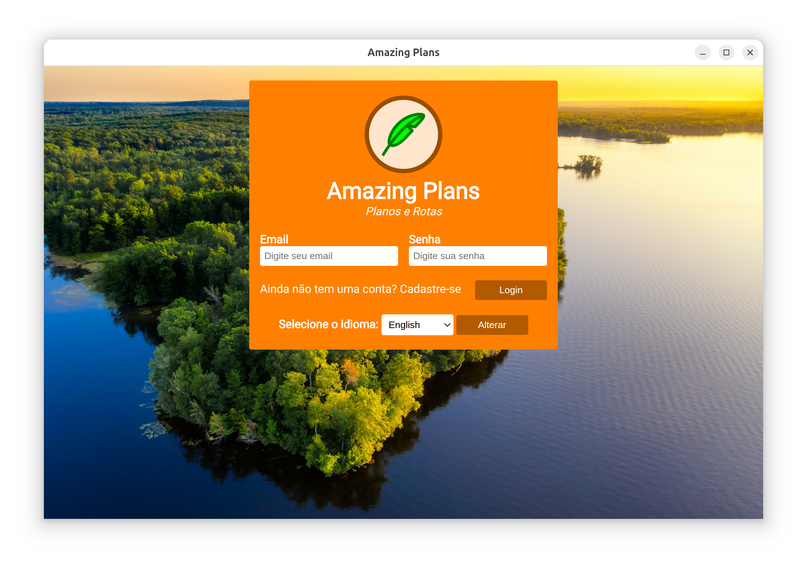
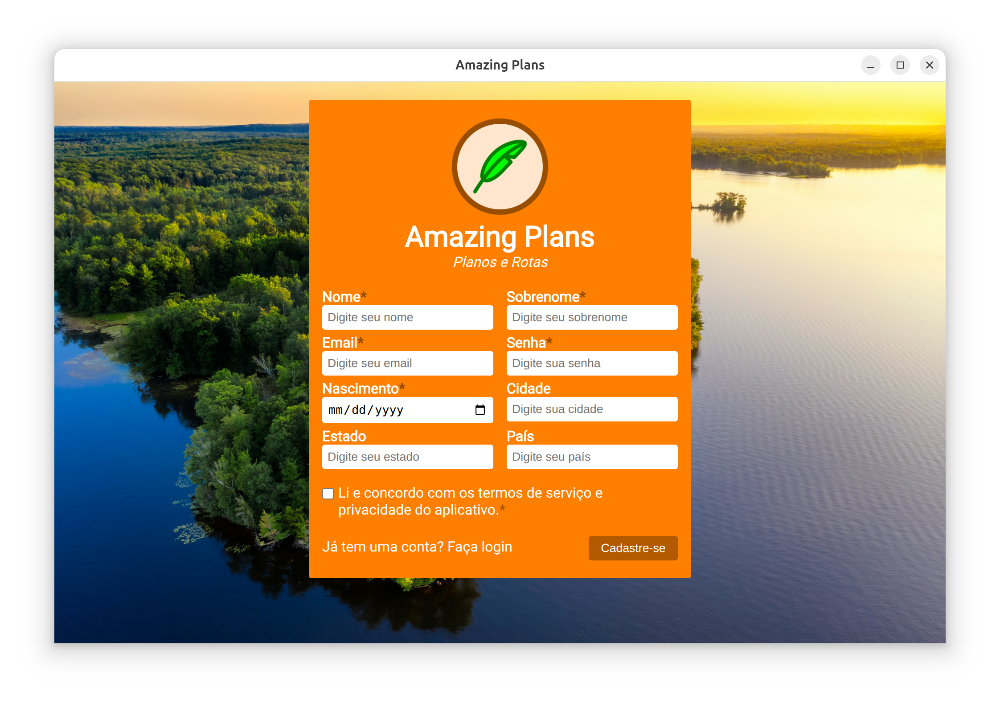
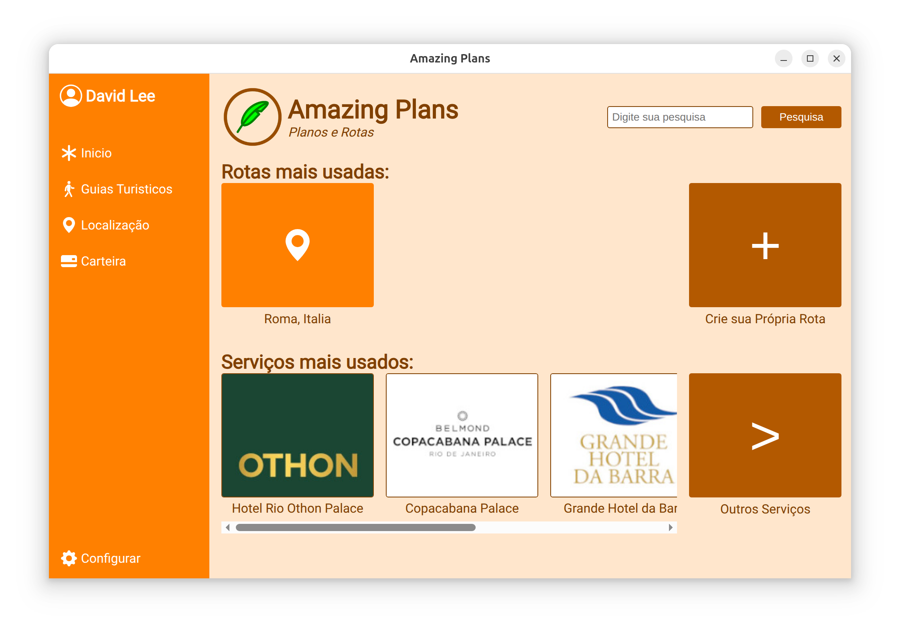
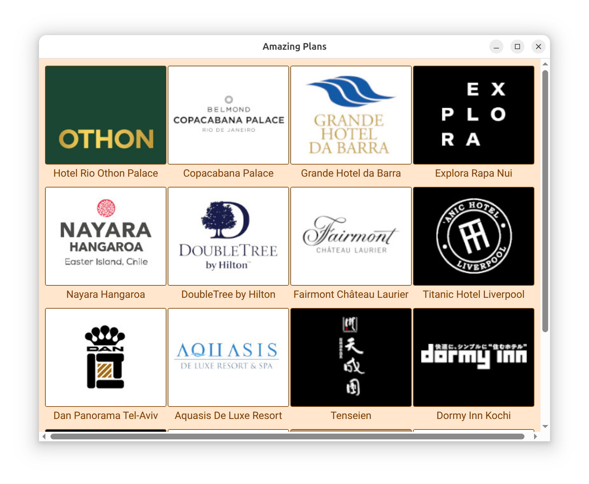
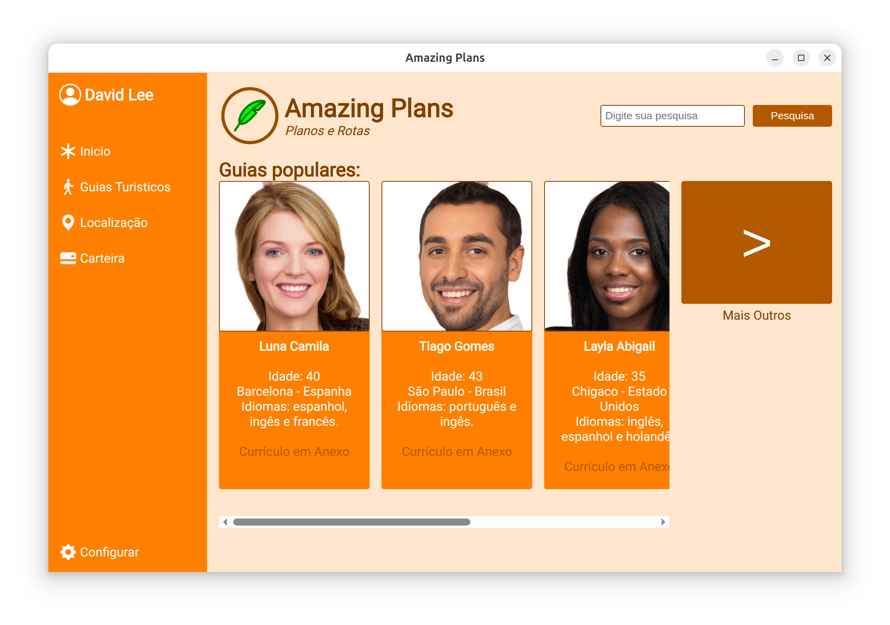
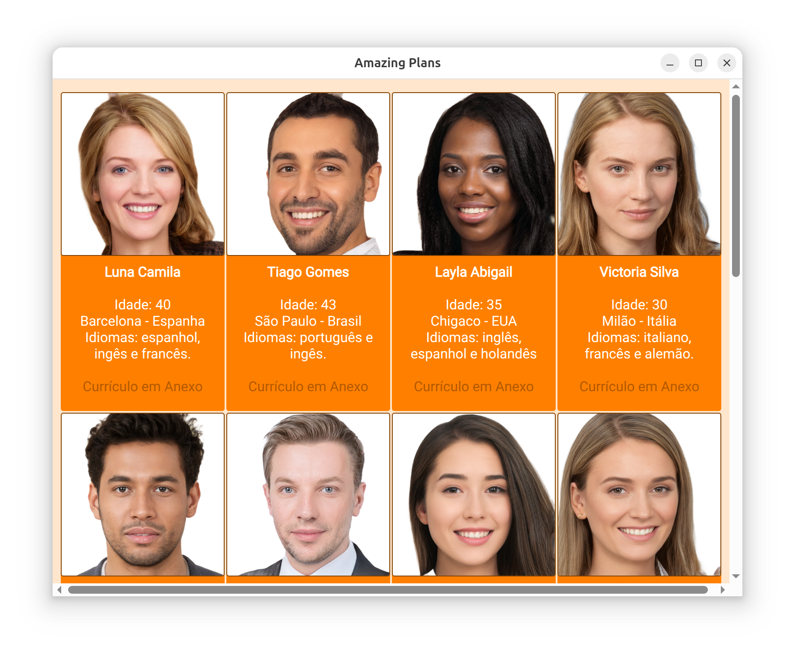
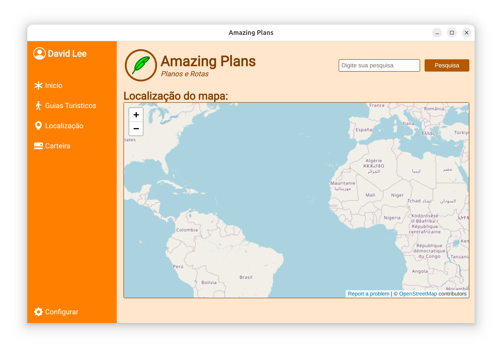
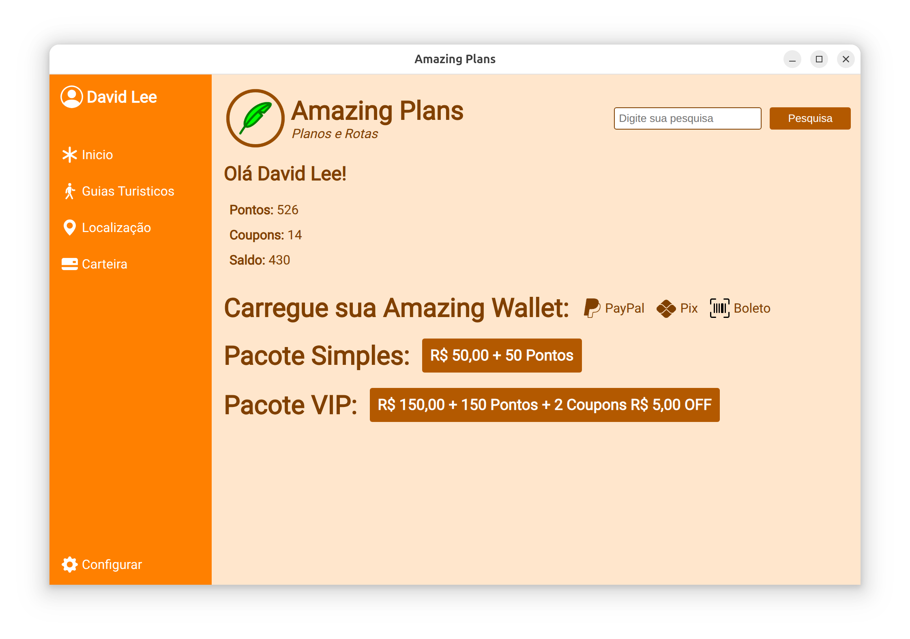
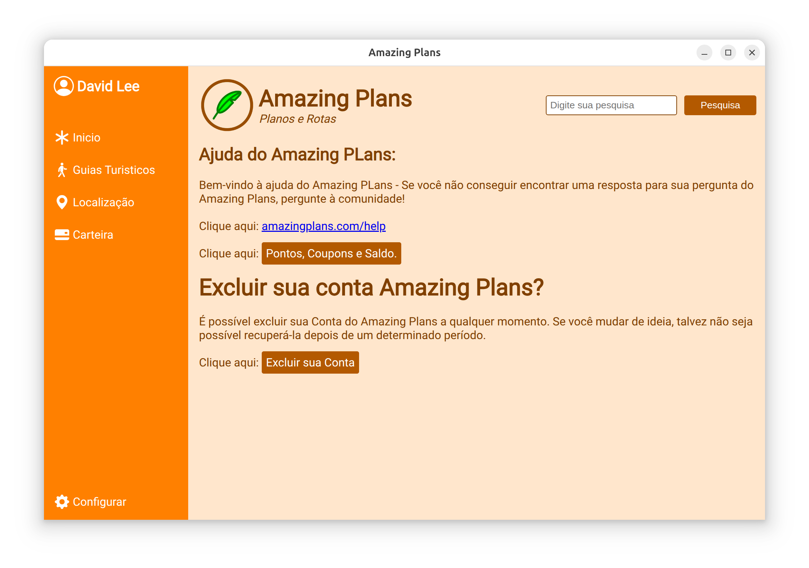
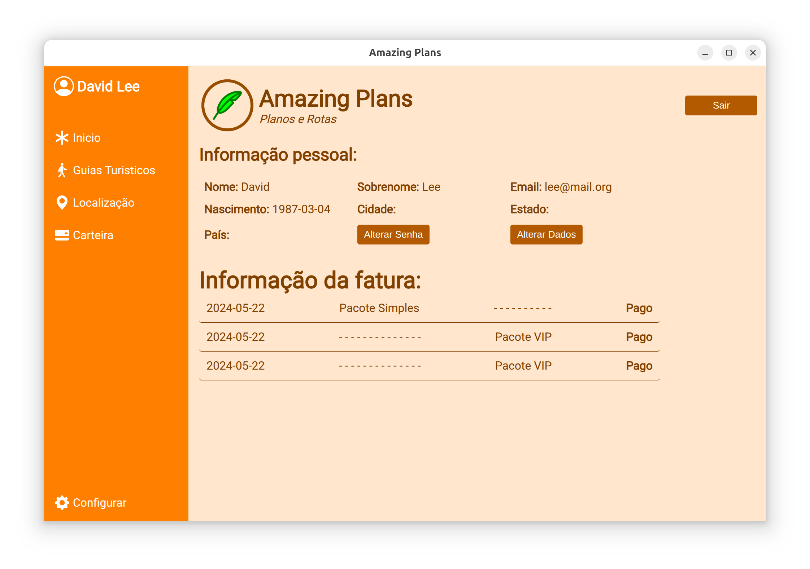

# Amazing Plans App

Uma aplicação desktop baseada em Electron que integra com um backend PHP/MySQL.

---

## 📄 Descrição do Projeto

**Amazing Plans App** é uma aplicação desktop desenvolvida como parte de um projeto universitário na **Uninorte**.

O aplicativo fornece uma interface intuitiva para gerenciar dados de usuários e interações com um banco de dados centralizado. Ele demonstra conceitos-chave em **desenvolvimento de aplicações desktop, arquitetura cliente-servidor e gerenciamento de banco de dados**, oferecendo experiência prática em desenvolvimento full-stack dentro de um ambiente acadêmico.

Principais funcionalidades:
- Interface desktop moderna e responsiva.
- Integração com banco de dados MySQL para gerenciamento seguro de dados.
- Fácil implantação como executável independente para Windows, macOS e Linux.
- Demonstração prática das capacidades do Electron para aplicações desktop multiplataforma.

Este projeto serve tanto como ferramenta de aprendizado quanto como aplicação funcional, ajudando estudantes a compreender o fluxo completo de desenvolvimento de software, desde a configuração do banco de dados até a implantação no cliente.

---

## 📸 Captura de Tela












---

## ⚙️ Configuração do Banco de Dados (PHPMyAdmin)

1. Abra o **PHPMyAdmin**.
2. Crie um novo banco de dados chamado **`register`**.
3. Vá para a aba **Import**.
4. Em **"File to import:"**, clique em **Browse** e selecione seu arquivo SQL: `database/register.sql`
5. Clique em **Import** para carregar o esquema do banco de dados.

---

## 💻 Configuração do Projeto

### 1. Execute o Prompt de Comando como Administrador
Abra o CMD com privilégios de administrador.

### 2. Configure o Diretório do Projeto
```bash
mkdir "Amazing Plans App"
cd "Amazing Plans App"
```

### 3. Inicialize o Projeto Node.js
```bash
npm init -y
```

### 4. Instale o Electron
```bash
npm install electron --save-dev
```

---

## 📝 Crie o main.js
```javascript
const { app, BrowserWindow, Menu } = require('electron');
const path = require('path');

function createWindow() {
  const win = new BrowserWindow({
    width: 1000,
    height: 630,
    icon: path.join(__dirname, 'img/logo.ico'),
    webPreferences: {
      nodeIntegration: true,
    },
  });

  // Load your backend
  // win.loadFile('index.html');
  win.loadURL('http://localhost/index_pt.php'); 
  // or 'http://localhost/amazing_plans/index_pt.php'
}

// Remove the application menu
Menu.setApplicationMenu(null);

app.whenReady().then(createWindow);

app.on('window-all-closed', () => {
  if (process.platform !== 'darwin') {
    app.quit();
  }
});

app.on('activate', () => {
  if (BrowserWindow.getAllWindows().length === 0) {
    createWindow();
  }
});
```

## 📦 Atualize o package.json
```json
{
  "name": "amazing-plans-app",
  "version": "1.0.0",
  "description": "",
  "main": "main.js",
  "scripts": {
    "start": "electron .",
    "build": "electron-builder"
  },
  "keywords": [],
  "author": "",
  "license": "MIT",
  "devDependencies": {
    "electron": "^38.0.0",
    "electron-builder": "^25.1.8"
  },
  "dependencies": {
    "express": "^4.21.1"
  },
  "build": {
    "appId": "com.yourapp.id",
    "mac": {
      "icon": "img/icon.icns"
    },
    "win": {
      "icon": "img/icon.ico",
      "target": "nsis",
      "sign": false
    },
    "linux": {
      "icon": "img/icon.png"
    },
    "nsis": {
      "oneClick": false,
      "perMachine": true,
      "allowToChangeInstallationDirectory": true
    }
  }
}
```

## 🚀 Executar a Aplicação
Inicie sua aplicação Electron:
```bash
npm start
```

## 📦 Compilar a Aplicação
Instale o `electron-builder`
```bash
npm install electron-builder --save-dev
```

2. Compile o arquivo `.exe` (Windows)
```bash
npm run build
```

## 📜 Licença
Este projeto está licenciado sob a Licença MIT – veja o arquivo LICENSE.

👉 Se quiser, posso gerar também a versão **completa do arquivo LICENSE** em português e inglês com o texto MIT.
