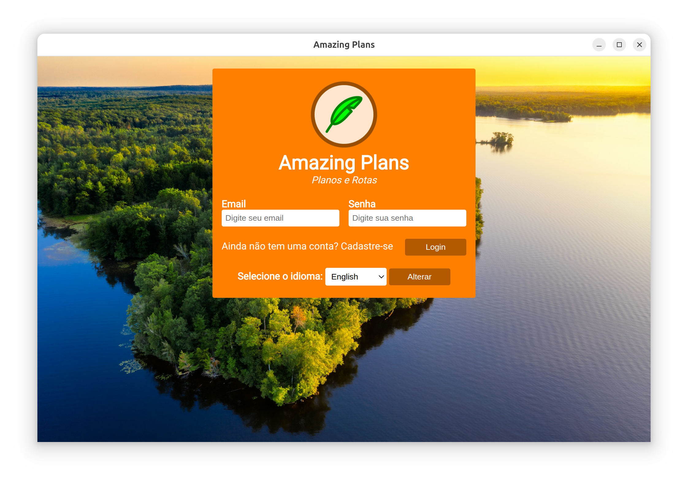
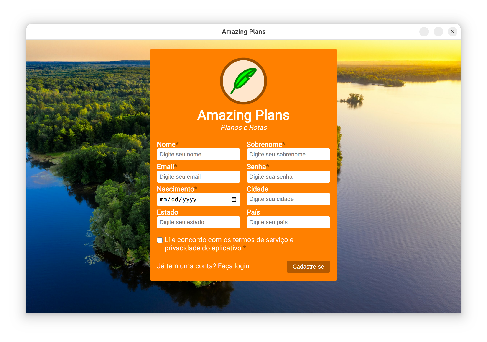
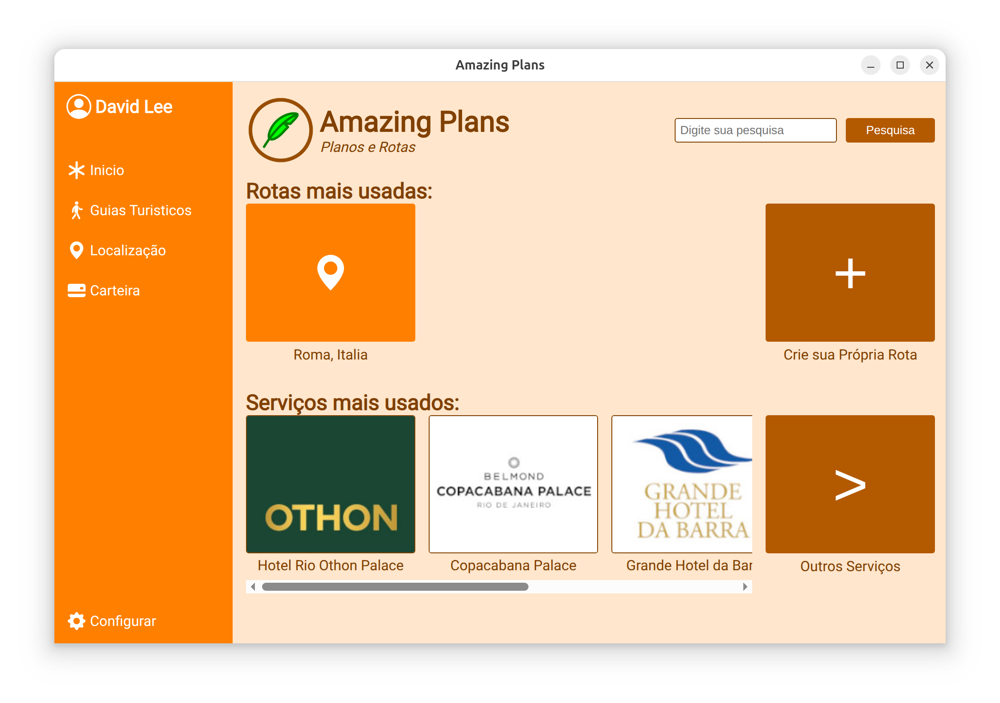
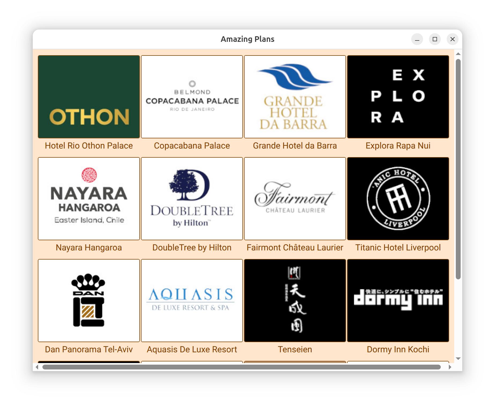
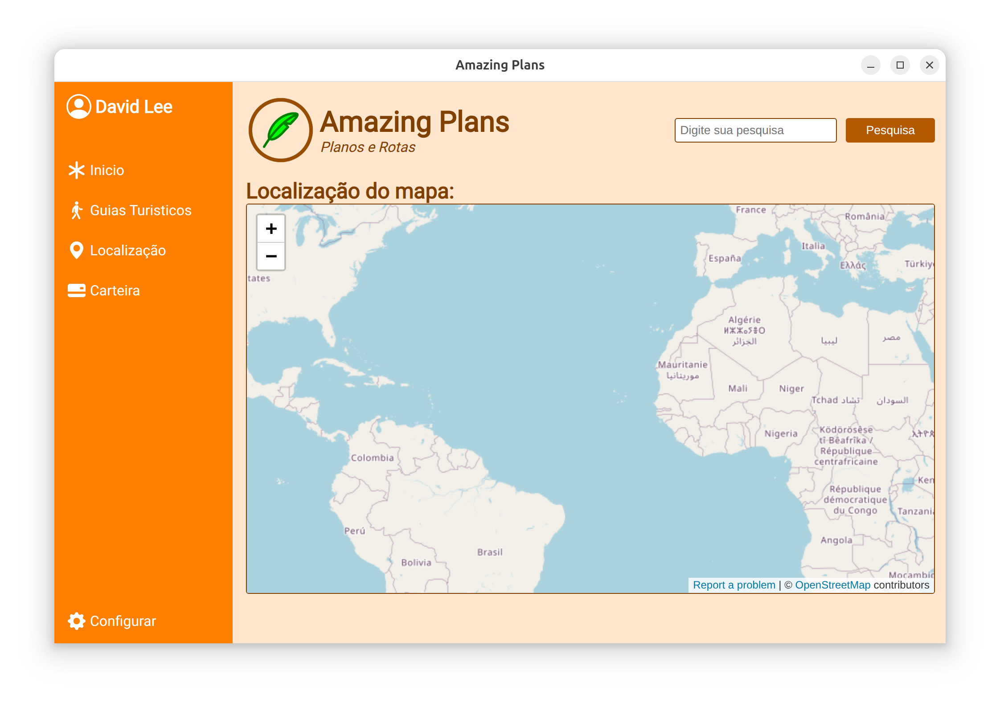
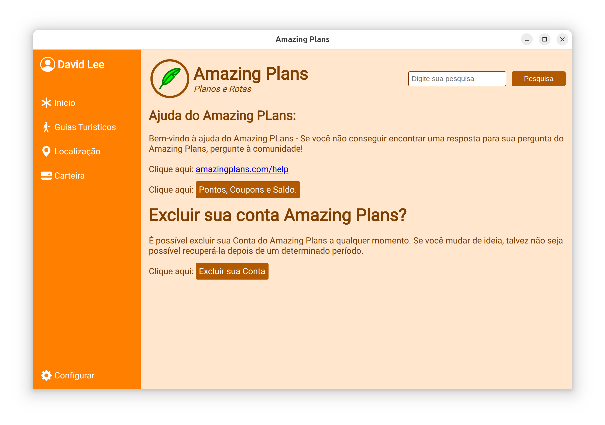
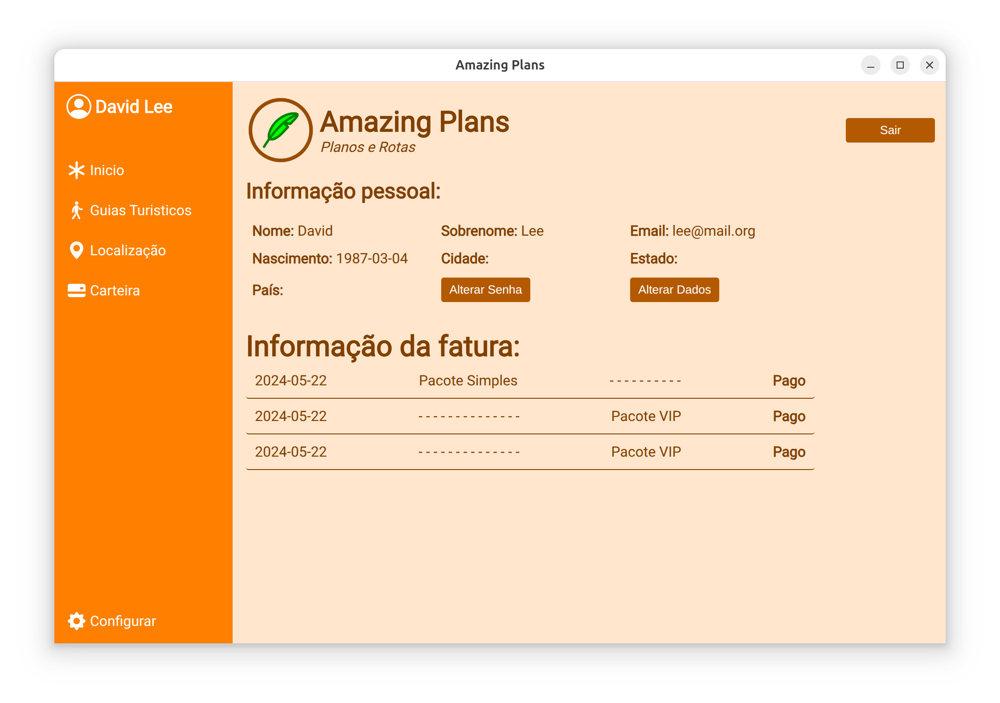

# Amazing Plans App

An Electron-based desktop application that integrates with a PHP/MySQL backend.

---

## 📄 Project Description

**Amazing Plans App** is a desktop application developed as part of a university project at **Uninorte**.

The application provides an intuitive interface for managing user data and interactions with a centralized database. It demonstrates key concepts in **desktop application development, client-server architecture, and database management**, offering practical experience in full-stack development within an academic environment.

Key features include:
- A modern, responsive desktop interface.
- Integration with a MySQL database for secure data management.
- Easy deployment as a standalone executable for Windows, macOS, and Linux.
- Practical demonstration of Electron’s capabilities for cross-platform desktop applications.

This project serves as both a learning tool and a functional application, helping students understand the end-to-end workflow of software development, from database setup to client-side deployment.

---

## 📸 Screenshot












---

## ⚙️ Database Setup (PHPMyAdmin)

1. Open **PHPMyAdmin**.
2. Create a new database named **`register`**.
3. Go to the **Import** tab.
4. Under **"File to import:"**, click **Browse** and select your SQL file: `database/register.sql`
5. Click **Import** to upload the database schema.

---

## 💻 Project Setup

### 1. Run Command Prompt as Administrator
Open CMD with administrator privileges.

### 2. Set Up Your Project Directory
```bash
mkdir "Amazing Plans App"
cd "Amazing Plans App"
```

### 3. Initialize Node.js Project
```bash
npm init -y
```

### 4. Install Electron
```bash
npm install electron --save-dev
```

---

## 📝 Create main.js
```javascript
const { app, BrowserWindow, Menu } = require('electron');
const path = require('path');

function createWindow() {
  const win = new BrowserWindow({
    width: 1000,
    height: 630,
    icon: path.join(__dirname, 'img/logo.ico'),
    webPreferences: {
      nodeIntegration: true,
    },
  });

  // Load your backend
  // win.loadFile('index.html');
  win.loadURL('http://localhost/index_pt.php'); 
  // or 'http://localhost/amazing_plans/index_pt.php'
}

// Remove the application menu
Menu.setApplicationMenu(null);

app.whenReady().then(createWindow);

app.on('window-all-closed', () => {
  if (process.platform !== 'darwin') {
    app.quit();
  }
});

app.on('activate', () => {
  if (BrowserWindow.getAllWindows().length === 0) {
    createWindow();
  }
});
```

## 📦 Update package.json
```json
{
  "name": "amazing-plans-app",
  "version": "1.0.0",
  "description": "",
  "main": "main.js",
  "scripts": {
    "start": "electron .",
    "build": "electron-builder"
  },
  "keywords": [],
  "author": "",
  "license": "MIT",
  "devDependencies": {
    "electron": "^38.0.0",
    "electron-builder": "^25.1.8"
  },
  "dependencies": {
    "express": "^4.21.1"
  },
  "build": {
    "appId": "com.yourapp.id",
    "mac": {
      "icon": "img/icon.icns"
    },
    "win": {
      "icon": "img/icon.ico",
      "target": "nsis",
      "sign": false
    },
    "linux": {
      "icon": "img/icon.png"
    },
    "nsis": {
      "oneClick": false,
      "perMachine": true,
      "allowToChangeInstallationDirectory": true
    }
  }
}
```

## 🚀 Run the Application
Start your Electron app:
```bash
npm start
```

## 📦 Build the Application
1. Install `electron-builder`
```bash
npm install electron-builder --save-dev
```

2. Build `.exe` File (Windows)
```bash
npm run build
```

## 📜 License
This project is licensed under the **MIT License** – see the LICENSE

👉 Do you want me to also generate a full **`LICENSE`** file with the MIT text, or just leave the reference in the README?
